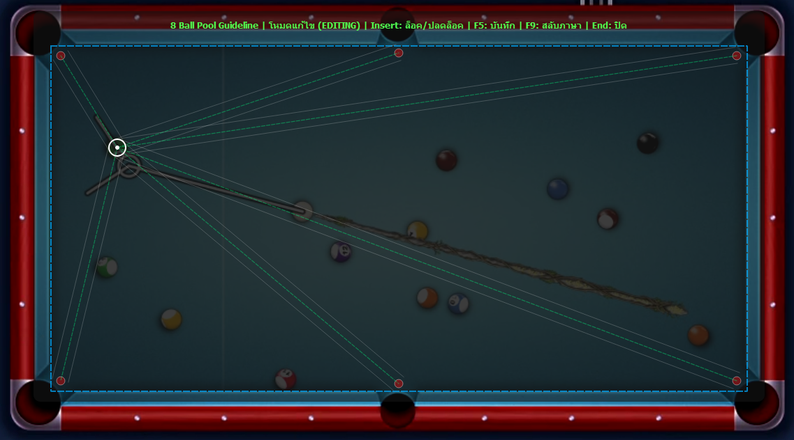

# 🎱 8 Ball Pool Guideline Overlay



โปรแกรม **Guideline Overlay สำหรับเกม 8 Ball Pool**  
ช่วยแสดงเส้นแนวการยิงจากตำแหน่งลูกบอลไปยังหลุมต่าง ๆ เพื่อช่วยวิเคราะห์มุมการยิง

This is a **Pool Guideline Overlay Tool** that helps visualize shot directions from the cue ball to all pockets.

---

## 🔄 อัพเดตล่าสุด
- เปลี่ยนเส้น Guideline เป็นเส้นทึบ (ไม่ใช่เส้นปะ)
- ปรับความหนาเส้นให้บางลง เพื่อความคมชัดและไม่บดบัง
- วงจุดสะท้อน (reflect target) ปรับให้โปร่งใสและขอบบางขึ้น

---

# 🇹🇭 ภาษาไทย

## 📌 เกี่ยวกับโปรแกรม

โปรแกรมนี้เป็น **Overlay Tool** ที่จะแสดงเส้นแนวการยิงบนหน้าจอ  
เพื่อช่วยให้ผู้เล่นวิเคราะห์มุมในการยิงลูกพูลไปยังหลุมต่าง ๆ

ตัวโปรแกรมจะทำงานเป็น **หน้าต่างโปร่งใส (Transparent Overlay)**  
และสามารถวางทับบนเกมได้

ผู้ใช้สามารถลากตำแหน่งลูกบอล และโปรแกรมจะคำนวณเส้นไปยังหลุมทั้งหมดให้ทันที

---

# ✨ ฟีเจอร์หลัก

### 🎱 Pool Table Overlay
แสดงกรอบโต๊ะพูลบนหน้าจอ

### 🎯 Automatic Guideline
วาดเส้นจากตำแหน่งลูกบอลไปยัง

- หลุมมุม 4 หลุม
- หลุมด้านข้าง 2 หลุม

รวมทั้งหมด **6 หลุม**

---

### ⚙️ Edit Mode

โหมดแก้ไขให้ผู้ใช้สามารถ

- ลากลูกบอล
- ปรับขนาดหน้าต่าง
- ย้ายตำแหน่ง Overlay

---

### 🔒 Lock Mode

เมื่อ Lock แล้ว

- โปรแกรมจะ **ไม่รับ input จาก mouse**
- สามารถคลิกเกมด้านล่างได้
- Overlay จะยังคงแสดงเส้นช่วยเล็ง

---

### 💾 Save Settings

โปรแกรมจะบันทึกค่าต่าง ๆ ลงไฟล์

pool_config.json

ข้อมูลที่บันทึก

- ตำแหน่งหน้าต่าง
- ขนาดหน้าต่าง
- ตำแหน่งลูกบอล
- ภาษา

---

### 🌐 Language Support

รองรับสองภาษา

- 🇹🇭 ไทย
- 🇺🇸 English

---

# ⌨️ Hotkeys

| Key | Function |
|----|----|
| **Insert** | ล็อค / ปลดล็อค |
| **F5** | บันทึกค่า |
| **F9** | เปลี่ยนภาษา |
| **End** | ปิดโปรแกรม |

---

# 🧠 ระบบการทำงานของโปรแกรม

โปรแกรมสร้างขึ้นด้วย

- Python
- PyQt5

โดยใช้ระบบ

### 🎨 QPainter Rendering

ใช้ `QPainter` ในการวาด

- เส้น Guideline
- หลุม
- ลูกบอล
- UI overlay

---

### 📐 Angle Calculation

คำนวณมุมด้วย

```
math.atan2()
```

เพื่อหาแนวเส้นจาก

```
Cue Ball → Pocket
```

---

### 📦 Configuration System

การตั้งค่าจะถูกเก็บในไฟล์

```
pool_config.json
```

ตัวอย่าง

```json
{
"x":100,
"y":100,
"w":1000,
"h":500,
"ball_x":200,
"ball_y":200,
"lang":"th"
}
```

---

# 📂 Project Structure

```
8ball-pool-guideline

│
├── main.py
├── pool_config.json
│
├── Images
│   └── Image.png
│
└── README.md
```

---

# 🚀 Installation

### 1️⃣ Install Python

Download Python

https://python.org

---

### 2️⃣ Install Dependencies

```
pip install PyQt5 keyboard
```

---

### 3️⃣ Run Program

```
python main.py
```

---

# 🇺🇸 English

## 📌 About

This program is a **Pool Aim Guideline Overlay Tool**.

It draws aiming lines from the cue ball to every pocket on the table to help visualize shot angles.

The window is **transparent** and stays **on top of the game**.

---

# ✨ Features

### 🎱 Pool Table Overlay

Displays a virtual pool table overlay.

---

### 🎯 Auto Guideline System

Automatically draws lines from the cue ball to:

- 4 corner pockets
- 2 side pockets

Total **6 pockets**

---

### ⚙️ Edit Mode

Allows user to

- Move the cue ball
- Resize the window
- Move the overlay

---

### 🔒 Lock Mode

When locked:

- Overlay becomes **mouse transparent**
- You can interact with the game underneath

---

### 💾 Auto Save Settings

Settings are stored in

```
pool_config.json
```

Saved data:

- Window position
- Window size
- Ball position
- Language

---

# ⌨️ Hotkeys

| Key | Function |
|----|----|
| **Insert** | Lock / Unlock |
| **F5** | Save Settings |
| **F9** | Change Language |
| **End** | Exit Program |

---

# 🧠 How It Works

The application is built using

- Python
- PyQt5

Main components:

### 🎨 Rendering System

Uses **QPainter** to draw

- Aiming lines
- Pockets
- Ball indicator
- UI overlay

---

### 📐 Angle Calculation

Angles are calculated using

```
math.atan2()
```

to determine shot directions.

---

### 📦 Config System

Settings are saved to

```
pool_config.json
```

---

# ⚠️ Disclaimer

This tool is made for **learning and visualization purposes**.

Use responsibly.

---

# 👨‍💻 Developer


Developed with Python & PyQt5
